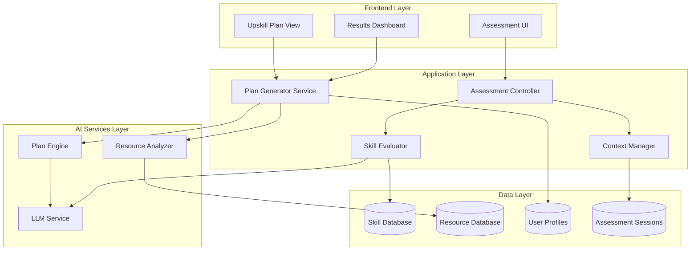
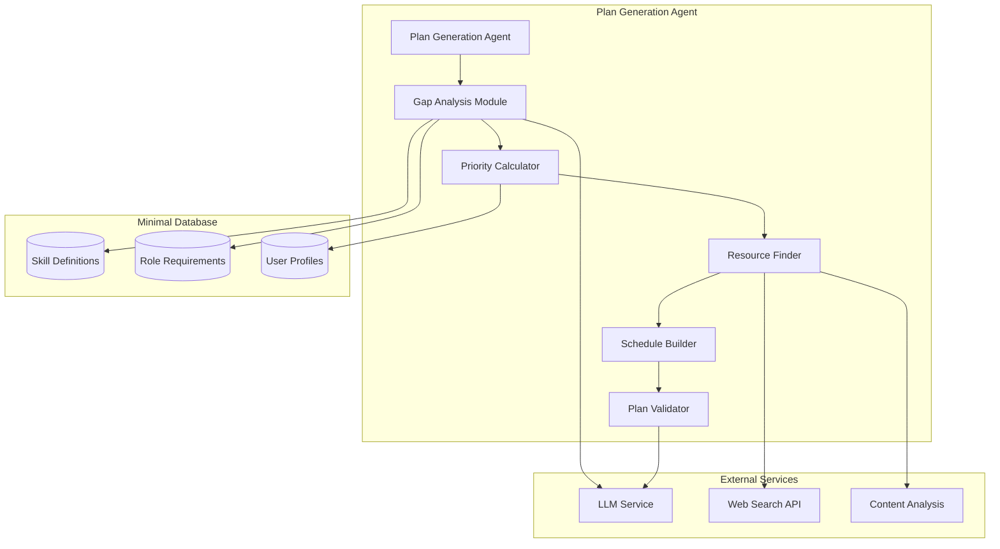

# Design Document: AI Agent Assessment System

## Overview

This document provides a comprehensive design for the AI Agent Assessment System, with primary focus on the Personalized Upskilling Plan Generation component (Requirement 4). The system will replace the current hardcoded assessment with an intelligent, adaptive evaluation system that generates personalized learning plans based on skill gap analysis.

## Architecture

### High-Level Architecture



## Components and Interfaces

### 1. Plan Generator Service (Core Focus)

The Plan Generator Service is the central component responsible for creating personalized upskilling plans.

#### Interface Definition

```typescript
interface PlanGeneratorService {
  generatePlan(request: PlanGenerationRequest): Promise<UpskillPlan>;
  updatePlan(planId: string, progress: LearningProgress): Promise<UpskillPlan>;
  getAlternativePlans(planId: string, constraints: TimeConstraints): Promise<UpskillPlan[]>;
  validatePlan(plan: UpskillPlan): Promise<PlanValidationResult>;
}

interface PlanGenerationRequest {
  userId: string;
  skillGaps: SkillGap[];
  userProfile: UserLearningProfile;
  timeConstraints: TimeConstraints;
  learningPreferences: LearningPreferences;
  roleRequirements: RoleRequirements;
}
```

#### Core Algorithm: Plan Generation Engine

```typescript
class PlanGenerationEngine {
  async generatePlan(request: PlanGenerationRequest): Promise<UpskillPlan> {
    // Step 1: Prioritize skill gaps
    const prioritizedGaps = await this.prioritizeSkillGaps(request.skillGaps, request.roleRequirements);
    
    // Step 2: Create learning dependency graph
    const dependencyGraph = await this.buildDependencyGraph(prioritizedGaps);
    
    // Step 3: Generate weekly learning schedule
    const weeklySchedule = await this.createWeeklySchedule(
      dependencyGraph, 
      request.timeConstraints,
      request.learningPreferences
    );
    
    // Step 4: Match resources to learning objectives
    const resourceMapping = await this.matchResources(weeklySchedule, request.userProfile);
    
    // Step 5: Create milestones and assessments
    const milestones = await this.generateMilestones(weeklySchedule, prioritizedGaps);
    
    // Step 6: Validate and optimize plan
    const optimizedPlan = await this.optimizePlan({
      schedule: weeklySchedule,
      resources: resourceMapping,
      milestones: milestones,
      constraints: request.timeConstraints
    });
    
    return optimizedPlan;
  }
}
```

### 2. Skill Gap Prioritization Algorithm

```typescript
interface SkillGapPrioritizer {
  prioritizeGaps(gaps: SkillGap[], roleRequirements: RoleRequirements): Promise<PrioritizedSkillGap[]>;
}

class AdvancedSkillGapPrioritizer implements SkillGapPrioritizer {
  async prioritizeGaps(gaps: SkillGap[], roleRequirements: RoleRequirements): Promise<PrioritizedSkillGap[]> {
    const prioritizedGaps: PrioritizedSkillGap[] = [];
    
    for (const gap of gaps) {
      const priority = await this.calculatePriority(gap, roleRequirements);
      const effort = await this.estimateEffort(gap);
      const impact = await this.calculateImpact(gap, roleRequirements);
      
      prioritizedGaps.push({
        ...gap,
        priority: priority,
        estimatedEffort: effort,
        businessImpact: impact,
        urgencyScore: this.calculateUrgency(priority, impact, effort)
      });
    }
    
    return prioritizedGaps.sort((a, b) => b.urgencyScore - a.urgencyScore);
  }
  
  private calculateUrgency(priority: number, impact: number, effort: number): number {
    // Weighted formula: (Priority * 0.4) + (Impact * 0.4) + (1/Effort * 0.2)
    return (priority * 0.4) + (impact * 0.4) + ((10 - effort) / 10 * 0.2);
  }
}
```

### 3. Learning Dependency Graph

```typescript
interface DependencyGraphBuilder {
  buildGraph(skills: PrioritizedSkillGap[]): Promise<LearningDependencyGraph>;
}

class LearningDependencyGraph {
  private nodes: Map<string, SkillNode> = new Map();
  private edges: Map<string, string[]> = new Map();
  
  addSkill(skill: PrioritizedSkillGap): void {
    const node: SkillNode = {
      skillId: skill.skillId,
      skillName: skill.skillName,
      currentLevel: skill.currentLevel,
      targetLevel: skill.targetLevel,
      prerequisites: skill.prerequisites || [],
      estimatedWeeks: this.calculateLearningWeeks(skill)
    };
    
    this.nodes.set(skill.skillId, node);
    this.edges.set(skill.skillId, skill.prerequisites || []);
  }
  
  getTopologicalOrder(): SkillNode[] {
    // Kahn's algorithm for topological sorting
    const inDegree = new Map<string, number>();
    const queue: string[] = [];
    const result: SkillNode[] = [];
    
    // Initialize in-degrees
    for (const [skillId] of this.nodes) {
      inDegree.set(skillId, 0);
    }
    
    for (const [, prerequisites] of this.edges) {
      for (const prereq of prerequisites) {
        inDegree.set(prereq, (inDegree.get(prereq) || 0) + 1);
      }
    }
    
    // Find nodes with no incoming edges
    for (const [skillId, degree] of inDegree) {
      if (degree === 0) {
        queue.push(skillId);
      }
    }
    
    // Process queue
    while (queue.length > 0) {
      const current = queue.shift()!;
      const node = this.nodes.get(current)!;
      result.push(node);
      
      const dependencies = this.edges.get(current) || [];
      for (const dep of dependencies) {
        const newDegree = inDegree.get(dep)! - 1;
        inDegree.set(dep, newDegree);
        if (newDegree === 0) {
          queue.push(dep);
        }
      }
    }
    
    return result;
  }
}
```

### 4. Weekly Schedule Generator

```typescript
interface WeeklyScheduleGenerator {
  createSchedule(
    dependencyOrder: SkillNode[], 
    timeConstraints: TimeConstraints,
    preferences: LearningPreferences
  ): Promise<WeeklyLearningSchedule>;
}

class AdaptiveScheduleGenerator implements WeeklyScheduleGenerator {
  async createSchedule(
    dependencyOrder: SkillNode[], 
    timeConstraints: TimeConstraints,
    preferences: LearningPreferences
  ): Promise<WeeklyLearningSchedule> {
    
    const schedule: WeeklyLearningSchedule = {
      totalWeeks: 0,
      weeks: [],
      totalHours: 0
    };
    
    let currentWeek = 1;
    let remainingHoursThisWeek = timeConstraints.hoursPerWeek;
    let currentWeekTasks: LearningTask[] = [];
    
    for (const skill of dependencyOrder) {
      const tasks = await this.generateLearningTasks(skill, preferences);
      
      for (const task of tasks) {
        if (task.estimatedHours <= remainingHoursThisWeek) {
          // Task fits in current week
          currentWeekTasks.push(task);
          remainingHoursThisWeek -= task.estimatedHours;
        } else {
          // Need to move to next week
          if (currentWeekTasks.length > 0) {
            schedule.weeks.push({
              weekNumber: currentWeek,
              tasks: [...currentWeekTasks],
              totalHours: timeConstraints.hoursPerWeek - remainingHoursThisWeek,
              focusSkills: this.extractFocusSkills(currentWeekTasks)
            });
            currentWeek++;
          }
          
          // Start new week
          currentWeekTasks = [task];
          remainingHoursThisWeek = timeConstraints.hoursPerWeek - task.estimatedHours;
        }
      }
    }
    
    // Add final week if has tasks
    if (currentWeekTasks.length > 0) {
      schedule.weeks.push({
        weekNumber: currentWeek,
        tasks: currentWeekTasks,
        totalHours: timeConstraints.hoursPerWeek - remainingHoursThisWeek,
        focusSkills: this.extractFocusSkills(currentWeekTasks)
      });
    }
    
    schedule.totalWeeks = currentWeek;
    schedule.totalHours = schedule.weeks.reduce((sum, week) => sum + week.totalHours, 0);
    
    return schedule;
  }
}
```

### 5. Resource Matching Engine

```typescript
interface ResourceMatcher {
  matchResources(
    schedule: WeeklyLearningSchedule, 
    userProfile: UserLearningProfile
  ): Promise<ResourceMapping>;
}

class IntelligentResourceMatcher implements ResourceMatcher {
  async matchResources(
    schedule: WeeklyLearningSchedule, 
    userProfile: UserLearningProfile
  ): Promise<ResourceMapping> {
    
    const resourceMapping: ResourceMapping = {
      weeklyResources: new Map(),
      alternativeResources: new Map(),
      resourceMetadata: new Map()
    };
    
    for (const week of schedule.weeks) {
      const weekResources: LearningResource[] = [];
      
      for (const task of week.tasks) {
        const matchedResources = await this.findBestResources(task, userProfile);
        weekResources.push(...matchedResources);
        
        // Store alternatives
        const alternatives = await this.findAlternativeResources(task, userProfile);
        resourceMapping.alternativeResources.set(task.taskId, alternatives);
      }
      
      resourceMapping.weeklyResources.set(week.weekNumber, weekResources);
    }
    
    return resourceMapping;
  }
  
  private async findBestResources(
    task: LearningTask, 
    userProfile: UserLearningProfile
  ): Promise<LearningResource[]> {
    
    const candidates = await this.resourceDatabase.findBySkillAndLevel(
      task.skillId, 
      task.targetLevel
    );
    
    const scoredResources = candidates.map(resource => ({
      resource,
      score: this.calculateResourceScore(resource, task, userProfile)
    }));
    
    scoredResources.sort((a, b) => b.score - a.score);
    
    return scoredResources
      .slice(0, 3) // Top 3 resources per task
      .map(sr => sr.resource);
  }
  
  private calculateResourceScore(
    resource: LearningResource, 
    task: LearningTask, 
    userProfile: UserLearningProfile
  ): number {
    let score = 0;
    
    // Learning style match (40% weight)
    if (resource.format === userProfile.preferredLearningStyle) {
      score += 40;
    }
    
    // Difficulty match (30% weight)
    const difficultyMatch = 1 - Math.abs(resource.difficulty - task.difficulty) / 10;
    score += difficultyMatch * 30;
    
    // Duration match (20% weight)
    const durationMatch = 1 - Math.abs(resource.estimatedHours - task.estimatedHours) / task.estimatedHours;
    score += durationMatch * 20;
    
    // Quality rating (10% weight)
    score += (resource.qualityRating / 5) * 10;
    
    return score;
  }
}
```

## Data Models

### Core Data Structures

```typescript
interface UpskillPlan {
  planId: string;
  userId: string;
  createdAt: Date;
  updatedAt: Date;
  status: PlanStatus;
  metadata: PlanMetadata;
  schedule: WeeklyLearningSchedule;
  resources: ResourceMapping;
  milestones: Milestone[];
  alternatives: AlternativePlan[];
}

interface PlanMetadata {
  totalWeeks: number;
  totalHours: number;
  skillsTargeted: string[];
  difficultyLevel: 'beginner' | 'intermediate' | 'advanced';
  estimatedCompletion: Date;
  successProbability: number;
}

interface SkillGap {
  skillId: string;
  skillName: string;
  currentLevel: number;
  targetLevel: number;
  importance: 'critical' | 'important' | 'nice-to-have';
  prerequisites: string[];
  description: string;
}

interface PrioritizedSkillGap extends SkillGap {
  priority: number; // 1-10 scale
  estimatedEffort: number; // weeks
  businessImpact: number; // 1-10 scale
  urgencyScore: number; // calculated priority
}

interface LearningTask {
  taskId: string;
  skillId: string;
  taskName: string;
  description: string;
  taskType: TaskType;
  difficulty: number; // 1-10 scale
  estimatedHours: number;
  prerequisites: string[];
  learningObjectives: string[];
  assessmentCriteria: string[];
}

interface LearningResource {
  resourceId: string;
  title: string;
  description: string;
  url: string;
  format: ResourceFormat;
  provider: string;
  difficulty: number; // 1-10 scale
  estimatedHours: number;
  qualityRating: number; // 1-5 scale
  tags: string[];
  prerequisites: string[];
  learningOutcomes: string[];
  lastUpdated: Date;
}

interface Milestone {
  milestoneId: string;
  weekNumber: number;
  title: string;
  description: string;
  successCriteria: string[];
  assessmentMethod: AssessmentMethod;
  skillsValidated: string[];
  isCompleted: boolean;
  completedAt?: Date;
}

interface UserLearningProfile {
  userId: string;
  preferredLearningStyle: LearningStyle;
  availableHours: number;
  timezone: string;
  previousExperience: ExperienceLevel;
  learningPace: 'slow' | 'moderate' | 'fast';
  motivationFactors: string[];
  constraints: LearningConstraint[];
}

interface TimeConstraints {
  hoursPerWeek: number;
  maxWeeks: number;
  preferredSchedule: SchedulePreference;
  deadlines: Deadline[];
}

// Enums and Types
type PlanStatus = 'draft' | 'active' | 'paused' | 'completed' | 'cancelled';
type TaskType = 'reading' | 'video' | 'practice' | 'project' | 'assessment' | 'discussion';
type ResourceFormat = 'article' | 'video' | 'course' | 'book' | 'tutorial' | 'documentation' | 'interactive';
type LearningStyle = 'visual' | 'auditory' | 'kinesthetic' | 'reading';
type AssessmentMethod = 'quiz' | 'project' | 'peer-review' | 'self-assessment' | 'practical-test';
type ExperienceLevel = 'beginner' | 'intermediate' | 'advanced' | 'expert';
```

### Extended Data Models for Advanced Features

```typescript
interface AlternativePlan {
  planId: string;
  title: string;
  description: string;
  timeCommitment: TimeConstraints;
  focusAreas: string[];
  tradeoffs: string[];
}

interface LearningProgress {
  userId: string;
  planId: string;
  currentWeek: number;
  completedTasks: string[];
  skillProgress: Map<string, SkillProgress>;
  timeSpent: number;
  lastActivity: Date;
}

interface SkillProgress {
  skillId: string;
  startLevel: number;
  currentLevel: number;
  targetLevel: number;
  confidence: number; // 1-10 scale
  lastAssessed: Date;
  evidence: ProgressEvidence[];
}

interface ProgressEvidence {
  type: 'completion' | 'assessment' | 'project' | 'peer-feedback';
  description: string;
  timestamp: Date;
  score?: number;
  feedback?: string;
}

interface ResourceDatabase {
  findBySkillAndLevel(skillId: string, level: number): Promise<LearningResource[]>;
  findByFormat(format: ResourceFormat): Promise<LearningResource[]>;
  findByProvider(provider: string): Promise<LearningResource[]>;
  searchResources(query: ResourceQuery): Promise<LearningResource[]>;
  getRating(resourceId: string): Promise<ResourceRating>;
  updateRating(resourceId: string, rating: ResourceRating): Promise<void>;
}

interface ResourceQuery {
  skills: string[];
  difficulty: number[];
  formats: ResourceFormat[];
  maxHours?: number;
  minRating?: number;
  tags?: string[];
}

interface ResourceRating {
  resourceId: string;
  averageRating: number;
  totalRatings: number;
  qualityMetrics: QualityMetrics;
  userFeedback: UserFeedback[];
}

interface QualityMetrics {
  accuracy: number;
  clarity: number;
  relevance: number;
  upToDate: number;
  engagement: number;
}
```

## Correctness Properties

*A property is a characteristic or behavior that should hold true across all valid executions of a system-essentially, a formal statement about what the system should do. Properties serve as the bridge between human-readable specifications and machine-verifiable correctness guarantees.*

### Property 1: Complete Gap Coverage
*For any* gap analysis result and generated upskill plan, all identified skill gaps should be addressed by at least one learning task in the plan
**Validates: Requirements 4.1**

### Property 2: Priority and Dependency Ordering
*For any* set of skill gaps with priorities and dependencies, the generated plan should schedule critical gaps before non-critical gaps, and prerequisite skills should appear before dependent skills
**Validates: Requirements 4.2**

### Property 3: Resource-Profile Matching
*For any* user learning profile and selected resources, the resources should match the user's preferred learning style and be appropriate for their current skill level
**Validates: Requirements 4.3**

### Property 4: Milestone Completeness
*For any* generated weekly learning plan, each week should contain at least one milestone with specific, measurable success criteria
**Validates: Requirements 4.4**

### Property 5: Time Constraint Consistency
*For any* set of time constraints (5, 10, 15 hours per week), the generated alternative plans should respect their respective time limits while covering the same skill gaps
**Validates: Requirements 4.5**

## Error Handling

### Plan Generation Failures
- **Invalid Input Handling**: When skill gaps or user profiles contain invalid data, the system should validate inputs and provide specific error messages
- **Resource Unavailability**: When required learning resources are unavailable, the system should substitute with alternative resources of similar quality
- **Dependency Conflicts**: When skill dependencies create circular references, the system should detect and resolve conflicts by breaking cycles at the least critical dependency
- **Time Constraint Violations**: When skill gaps cannot be addressed within time constraints, the system should prioritize critical gaps and suggest extended timelines

### AI Service Integration Errors
- **API Rate Limiting**: Implement exponential backoff and request queuing when AI services hit rate limits
- **Service Unavailability**: Fallback to cached responses or simplified plan generation when AI services are down
- **Invalid AI Responses**: Validate AI-generated content and retry with modified prompts if responses don't meet quality criteria

### Data Consistency Errors
- **Concurrent Plan Updates**: Handle race conditions when multiple processes attempt to update the same plan
- **Resource Database Sync**: Ensure resource availability and metadata remain consistent across plan generation
- **User Profile Changes**: Handle mid-assessment profile updates without corrupting ongoing plan generation

## Testing Strategy

### Dual Testing Approach
The system will use both unit testing and property-based testing to ensure comprehensive coverage:

**Unit Tests** will focus on:
- Specific examples of plan generation with known inputs and expected outputs
- Edge cases like empty skill gaps, single-skill plans, and maximum time constraints
- Integration points between components (Plan Generator ↔ Resource Matcher)
- Error conditions and fallback behaviors

**Property-Based Tests** will focus on:
- Universal properties that hold across all valid inputs (the 5 correctness properties above)
- Comprehensive input coverage through randomized skill gaps, user profiles, and constraints
- Invariant validation (e.g., total plan hours never exceed time constraints)
- Round-trip properties (e.g., plan serialization/deserialization)

### Property-Based Testing Configuration
- **Minimum 100 iterations** per property test due to randomization
- **Test Framework**: Use fast-check (TypeScript) for property-based testing
- **Tag Format**: Each test tagged as **Feature: ai-agent-assessment, Property {number}: {property_text}**
- **Data Generators**: Custom generators for SkillGap, UserProfile, and TimeConstraints objects
- **Shrinking Strategy**: Implement custom shrinking to find minimal failing examples

### Integration Testing
- **End-to-End Plan Generation**: Test complete flow from gap analysis to final plan delivery
- **AI Service Mocking**: Mock AI services for consistent testing while maintaining integration test coverage
- **Database Integration**: Test with real database connections to validate data persistence and retrieval
- **Performance Testing**: Validate response times under various load conditions

## Detailed Agent Design: Personalized Upskilling Plan Generation

### Agent Architecture Overview

The Plan Generation Agent operates as an intelligent system that combines minimal stored data with real-time AI analysis to create personalized learning plans. Here's the detailed architecture:



### Minimal Database Schema

The system requires only essential data, relying on AI intelligence for complex analysis:

```typescript
// Core skill definitions (minimal set)
interface SkillDefinition {
  skillId: string;
  name: string;
  category: string;
  description: string;
  managerialLevel: number; // 1-10 expected level for managers
  seniorLevel: number; // 1-10 expected level for senior engineers
  prerequisites: string[]; // Basic dependencies
}

// Role-specific requirements (lightweight)
interface RoleRequirement {
  roleId: string;
  roleName: string;
  experienceLevel: string; // "junior", "mid", "senior", "manager"
  criticalSkills: string[]; // Must-have skills
  importantSkills: string[]; // Nice-to-have skills
  industryContext: string; // "startup", "enterprise", "consulting"
}

// User profile (essential info only)
interface UserProfile {
  userId: string;
  role: string;
  experienceYears: number;
  industryType: string;
  timeAvailable: number; // hours per week
  learningStyle: string; // "visual", "hands-on", "reading", "mixed"
  currentSkills: SkillScore[];
  lastAssessment: Date;
}

interface SkillScore {
  skillId: string;
  score: number; // 1-10
  confidence: number; // How confident we are in this score
  lastUpdated: Date;
}
```

### Agent Intelligence Modules

#### 1. Gap Analysis Module

```typescript
class IntelligentGapAnalyzer {
  async analyzeGaps(userProfile: UserProfile, roleRequirements: RoleRequirement): Promise<SkillGap[]> {
    const prompt = `
    Analyze skill gaps for a ${userProfile.role} with ${userProfile.experienceYears} years of experience.
    
    Current Skills:
    ${userProfile.currentSkills.map(s => `${s.skillId}: ${s.score}/10`).join('\n')}
    
    Role Requirements:
    Critical Skills: ${roleRequirements.criticalSkills.join(', ')}
    Important Skills: ${roleRequirements.importantSkills.join(', ')}
    
    For each skill gap, provide:
    1. Gap severity (1-10)
    2. Business impact if not addressed
    3. Learning difficulty estimate
    4. Prerequisites needed
    5. Recommended target level
    
    Consider the user's seniority level and management responsibilities.
    `;
    
    const analysis = await this.llmService.analyze(prompt);
    return this.parseGapAnalysis(analysis);
  }
}
```

#### 2. Priority Calculator

```typescript
class ManagerialPriorityCalculator {
  calculatePriority(gap: SkillGap, userProfile: UserProfile): PriorityScore {
    const managerialWeight = userProfile.experienceYears > 8 ? 1.5 : 1.0;
    const businessImpact = this.calculateBusinessImpact(gap, userProfile.role);
    const learningEfficiency = this.calculateLearningEfficiency(gap, userProfile);
    
    return {
      overallScore: (businessImpact * managerialWeight + learningEfficiency) / 2,
      reasoning: this.generatePriorityReasoning(gap, userProfile),
      urgency: this.calculateUrgency(gap, userProfile)
    };
  }
  
  private calculateBusinessImpact(gap: SkillGap, role: string): number {
    // AI-powered business impact calculation
    const prompt = `
    For a ${role}, rate the business impact (1-10) of having a skill gap in ${gap.skillName}.
    Consider:
    - Team leadership responsibilities
    - Strategic decision making
    - Technology adoption influence
    - Risk management needs
    `;
    
    return this.llmService.getNumericScore(prompt);
  }
}
```

#### 3. Resource Finder Agent

```typescript
class IntelligentResourceFinder {
  async findResources(skillGap: SkillGap, userProfile: UserProfile): Promise<LearningResource[]> {
    // Step 1: Generate search queries
    const searchQueries = await this.generateSearchQueries(skillGap, userProfile);
    
    // Step 2: Search for resources
    const rawResources = await Promise.all(
      searchQueries.map(query => this.webSearchService.search(query))
    );
    
    // Step 3: AI-powered resource evaluation
    const evaluatedResources = await this.evaluateResources(
      rawResources.flat(),
      skillGap,
      userProfile
    );
    
    // Step 4: Personalize recommendations
    return this.personalizeRecommendations(evaluatedResources, userProfile);
  }
  
  private async generateSearchQueries(skillGap: SkillGap, userProfile: UserProfile): Promise<string[]> {
    const prompt = `
    Generate 3-5 search queries to find learning resources for ${skillGap.skillName} 
    for a ${userProfile.role} with ${userProfile.experienceYears} years of experience.
    
    Current level: ${skillGap.currentLevel}/10
    Target level: ${skillGap.targetLevel}/10
    
    Focus on:
    - Management-relevant applications
    - Practical implementation guides
    - Industry best practices
    - Strategic considerations
    
    Return queries that will find high-quality, recent resources.
    `;
    
    const response = await this.llmService.generate(prompt);
    return this.parseSearchQueries(response);
  }
  
  private async evaluateResources(resources: any[], skillGap: SkillGap, userProfile: UserProfile): Promise<LearningResource[]> {
    const evaluationPrompt = `
    Evaluate these learning resources for ${skillGap.skillName}:
    
    ${resources.map(r => `Title: ${r.title}\nURL: ${r.url}\nDescription: ${r.description}`).join('\n\n')}
    
    User Context:
    - Role: ${userProfile.role}
    - Experience: ${userProfile.experienceYears} years
    - Current Level: ${skillGap.currentLevel}/10
    - Target Level: ${skillGap.targetLevel}/10
    - Learning Style: ${userProfile.learningStyle}
    
    For each resource, provide:
    1. Relevance score (1-10)
    2. Quality assessment (1-10)
    3. Difficulty level (1-10)
    4. Estimated time to complete
    5. Management applicability (1-10)
    6. Practical value (1-10)
    
    Rank resources by overall suitability.
    `;
    
    const evaluation = await this.llmService.analyze(evaluationPrompt);
    return this.parseResourceEvaluation(evaluation, resources);
  }
}
```

#### 4. Schedule Builder Agent

```typescript
class AdaptiveScheduleBuilder {
  async buildSchedule(
    prioritizedGaps: PrioritizedSkillGap[],
    userProfile: UserProfile
  ): Promise<WeeklySchedule> {
    
    const schedulePrompt = `
    Create a weekly learning schedule for a ${userProfile.role} with ${userProfile.experienceYears} years of experience.
    
    Available time: ${userProfile.timeAvailable} hours per week
    Learning style: ${userProfile.learningStyle}
    
    Skill gaps to address (in priority order):
    ${prioritizedGaps.map(g => 
      `${g.skillName}: ${g.currentLevel} → ${g.targetLevel} (Priority: ${g.priority})`
    ).join('\n')}
    
    Create a 12-week plan with:
    1. Week-by-week focus areas
    2. Specific learning activities
    3. Time allocation per activity
    4. Milestones and checkpoints
    5. Management-specific applications
    
    Consider:
    - Skill dependencies and prerequisites
    - Learning curve and difficulty progression
    - Practical application opportunities
    - Team leadership integration
    - Business impact timing
    `;
    
    const schedule = await this.llmService.generate(schedulePrompt);
    return this.parseSchedule(schedule, prioritizedGaps);
  }
}
```

### Sample Scenario Validation

Let's validate the design against your sample scenario:

**Input:**
- Role: Software Engineering Manager
- Experience: 13 years
- Skills with gaps: Agentic AI Systems (5/10), AI Risk Ethics & Compliance (4/10), AI-Augmented Decision Making (4/10), AI Productivity & Automation (6/10), AI Tool & Ecosystem Literacy (6/10)

**Agent Processing:**

#### 1. Gap Analysis Output
```typescript
const analyzedGaps = [
  {
    skillName: "AI Risk Ethics & Compliance",
    currentLevel: 4,
    targetLevel: 8, // High for managers
    gapSeverity: 9, // Critical for leadership
    businessImpact: 10, // Regulatory/legal risks
    learningDifficulty: 6, // Moderate - policy focused
    prerequisites: ["AI Foundations"], // Already strong (9/10)
    reasoning: "As a senior manager, compliance knowledge is critical for team guidance and risk mitigation"
  },
  {
    skillName: "Agentic AI Systems", 
    currentLevel: 5,
    targetLevel: 7, // Moderate for managers
    gapSeverity: 6,
    businessImpact: 8, // Strategic technology decisions
    learningDifficulty: 8, // Technical complexity
    prerequisites: ["AI-Augmented Software Engineering"], // Moderate (7/10)
    reasoning: "Important for strategic technology adoption and team direction"
  },
  // ... other gaps
];
```

#### 2. Priority Calculation
```typescript
const priorities = [
  {
    skill: "AI Risk Ethics & Compliance",
    priority: 9.5, // (10 * 1.5 + 6) / 2 = 9.5 (high business impact, managerial weight)
    urgency: "Critical - immediate focus needed",
    reasoning: "Regulatory compliance is essential for leadership roles"
  },
  {
    skill: "AI-Augmented Decision Making",
    priority: 8.2,
    urgency: "High - core management competency",
    reasoning: "Direct impact on daily management effectiveness"
  }
  // ... others
];
```

#### 3. Resource Discovery
```typescript
const resources = await resourceFinder.findResources({
  skillName: "AI Risk Ethics & Compliance",
  searchQueries: [
    "AI ethics compliance framework enterprise managers 2024",
    "AI governance best practices software engineering teams",
    "AI risk management strategies technical leaders"
  ],
  evaluatedResources: [
    {
      title: "AI Governance Framework for Engineering Leaders",
      url: "...",
      relevanceScore: 9,
      qualityScore: 8,
      managementApplicability: 10,
      estimatedHours: 8,
      format: "interactive course"
    }
    // ... more resources
  ]
});
```

#### 4. Generated Schedule (Sample Week)
```typescript
const weeklySchedule = {
  week1: {
    focusSkill: "AI Risk Ethics & Compliance",
    totalHours: 10, // User's available time
    activities: [
      {
        activity: "AI Governance Framework Study",
        hours: 4,
        type: "reading",
        milestone: "Complete governance framework overview"
      },
      {
        activity: "Team Risk Assessment Exercise",
        hours: 3,
        type: "practical",
        milestone: "Identify 3 key risks in current AI usage"
      },
      {
        activity: "Industry Case Study Analysis",
        hours: 2,
        type: "analysis",
        milestone: "Document lessons learned from 2 case studies"
      },
      {
        activity: "Policy Draft Creation",
        hours: 1,
        type: "application",
        milestone: "Draft initial AI usage policy outline"
      }
    ],
    managementApplication: "Apply learnings to current team AI tool usage policies"
  }
  // ... weeks 2-12
};
```

### Database Storage Requirements

**Minimal Storage Needed:**

```sql
-- Skill definitions (10-20 core AI skills)
CREATE TABLE skills (
  skill_id VARCHAR(50) PRIMARY KEY,
  name VARCHAR(100),
  category VARCHAR(50),
  description TEXT,
  manager_target_level INT,
  senior_target_level INT
);

-- Role requirements (5-10 common roles)
CREATE TABLE role_requirements (
  role_id VARCHAR(50) PRIMARY KEY,
  role_name VARCHAR(100),
  experience_level VARCHAR(20),
  critical_skills JSON,
  important_skills JSON
);

-- User profiles (lightweight)
CREATE TABLE user_profiles (
  user_id VARCHAR(50) PRIMARY KEY,
  role VARCHAR(50),
  experience_years INT,
  time_available INT,
  learning_style VARCHAR(20),
  current_skills JSON,
  last_assessment TIMESTAMP
);

-- Generated plans (for persistence)
CREATE TABLE upskill_plans (
  plan_id VARCHAR(50) PRIMARY KEY,
  user_id VARCHAR(50),
  created_at TIMESTAMP,
  plan_data JSON, -- Full plan stored as JSON
  status VARCHAR(20)
);
```

**Total Storage:** ~50-100 skill definitions, ~10 role templates, user profiles, and generated plans. Very lightweight compared to traditional systems.

### Agent Intelligence Benefits

1. **Dynamic Analysis**: No need to pre-define all skill relationships - AI figures them out
2. **Current Resources**: Always finds up-to-date learning materials through web search
3. **Contextual Recommendations**: Considers user's specific role, experience, and constraints
4. **Adaptive Planning**: Can adjust plans based on progress and changing needs
5. **Minimal Maintenance**: No need to constantly update resource databases

This approach leverages AI intelligence to create highly personalized, current, and relevant upskilling plans with minimal data storage requirements.

## Additional Data Requirements

### Enhanced Skill Database Schema

```typescript
interface EnhancedSkillDatabase {
  // Core skill definitions
  skills: Map<string, SkillDefinition>;
  
  // Skill relationships and dependencies
  dependencies: Map<string, SkillDependency[]>;
  
  // Role-specific skill requirements
  roleRequirements: Map<string, RoleSkillRequirement[]>;
  
  // Learning pathways and progressions
  learningPaths: Map<string, LearningPath>;
  
  // Assessment criteria for each skill level
  assessmentCriteria: Map<string, AssessmentCriteria[]>;
}

interface SkillDefinition {
  skillId: string;
  name: string;
  category: SkillCategory;
  description: string;
  levels: SkillLevel[];
  tags: string[];
  industry: string[];
  lastUpdated: Date;
  version: string;
}

interface SkillLevel {
  level: number; // 1-10 scale
  name: string; // e.g., "Beginner", "Intermediate", "Advanced"
  description: string;
  competencies: string[]; // What you can do at this level
  timeToAchieve: number; // Estimated hours from previous level
  prerequisites: string[]; // Required skills/knowledge
}

interface SkillDependency {
  dependentSkill: string;
  prerequisiteSkill: string;
  dependencyType: 'hard' | 'soft' | 'recommended';
  minimumLevel: number;
  description: string;
}

interface RoleSkillRequirement {
  roleId: string;
  skillId: string;
  minimumLevel: number;
  importance: 'critical' | 'important' | 'nice-to-have';
  businessJustification: string;
  marketDemand: number; // 1-10 scale
}

interface LearningPath {
  pathId: string;
  name: string;
  description: string;
  targetRole: string;
  skills: string[];
  estimatedWeeks: number;
  difficulty: 'beginner' | 'intermediate' | 'advanced';
  prerequisites: string[];
  outcomes: string[];
}
```

### Comprehensive Resource Database

```typescript
interface ComprehensiveResourceDatabase {
  // Learning resources with detailed metadata
  resources: Map<string, DetailedLearningResource>;
  
  // Resource providers and their quality metrics
  providers: Map<string, ResourceProvider>;
  
  // User ratings and reviews
  ratings: Map<string, ResourceRating[]>;
  
  // Resource effectiveness tracking
  effectiveness: Map<string, EffectivenessMetrics>;
  
  // Content freshness and updates
  contentTracking: Map<string, ContentMetadata>;
}

interface DetailedLearningResource extends LearningResource {
  // Enhanced metadata
  author: string;
  publishedDate: Date;
  lastReviewed: Date;
  language: string;
  accessibility: AccessibilityFeatures;
  
  // Learning analytics
  completionRate: number;
  averageTimeSpent: number;
  userSatisfaction: number;
  
  // Content structure
  chapters: ResourceChapter[];
  exercises: Exercise[];
  assessments: Assessment[];
  
  // Integration capabilities
  apiEndpoints: string[];
  downloadable: boolean;
  offlineCapable: boolean;
}

interface ResourceProvider {
  providerId: string;
  name: string;
  reputation: number; // 1-10 scale
  specializations: string[];
  qualityConsistency: number;
  updateFrequency: 'daily' | 'weekly' | 'monthly' | 'quarterly';
  supportQuality: number;
  pricing: PricingModel;
}

interface EffectivenessMetrics {
  resourceId: string;
  skillImprovementRate: number; // Average skill level increase
  knowledgeRetention: number; // Long-term retention rate
  practicalApplication: number; // How well users apply learned skills
  timeToCompetency: number; // Average time to reach target level
  dropoutRate: number; // Percentage who don't complete
}
```

### User Learning Analytics

```typescript
interface UserLearningAnalytics {
  // Learning behavior patterns
  learningPatterns: Map<string, LearningPattern>;
  
  // Performance tracking
  performanceHistory: Map<string, PerformanceRecord[]>;
  
  // Engagement metrics
  engagementData: Map<string, EngagementMetrics>;
  
  // Personalization data
  personalizationProfile: Map<string, PersonalizationData>;
}

interface LearningPattern {
  userId: string;
  preferredTimeSlots: TimeSlot[];
  sessionDuration: number; // Average minutes per session
  learningVelocity: number; // Skills learned per week
  retentionRate: number; // Knowledge retention percentage
  strugglingAreas: string[]; // Skills that take longer to learn
  strengths: string[]; // Skills learned quickly
  motivationTriggers: string[]; // What keeps user engaged
}

interface PerformanceRecord {
  timestamp: Date;
  skillId: string;
  assessmentType: string;
  score: number;
  timeSpent: number;
  attempts: number;
  feedback: string;
  improvementSuggestions: string[];
}

interface EngagementMetrics {
  userId: string;
  weeklyActiveTime: number;
  streakDays: number;
  completionRate: number;
  interactionQuality: number; // Depth of engagement
  socialInteractions: number; // Forum posts, peer reviews, etc.
  helpSeekingBehavior: number; // How often user asks for help
}
```

### AI Agent Context Database

```typescript
interface AIAgentContextDatabase {
  // Conversation histories and context
  conversationSessions: Map<string, ConversationSession>;
  
  // Assessment decision logs
  assessmentDecisions: Map<string, AssessmentDecision[]>;
  
  // Plan generation reasoning
  planGenerationLogs: Map<string, PlanGenerationLog>;
  
  // AI model performance tracking
  modelPerformance: Map<string, ModelPerformanceMetrics>;
}

interface ConversationSession {
  sessionId: string;
  userId: string;
  startTime: Date;
  endTime?: Date;
  messages: ConversationMessage[];
  skillsAssessed: string[];
  contextEvolution: ContextSnapshot[];
  finalAssessment: AssessmentSummary;
}

interface ConversationMessage {
  messageId: string;
  timestamp: Date;
  sender: 'user' | 'ai';
  content: string;
  intent: MessageIntent;
  skillRelevance: Map<string, number>; // Which skills this message relates to
  confidenceIndicators: string[]; // Phrases indicating user confidence
  knowledgeSignals: string[]; // Technical terms, concepts mentioned
}

interface AssessmentDecision {
  decisionId: string;
  timestamp: Date;
  skillId: string;
  previousScore: number;
  newScore: number;
  reasoning: string;
  evidenceUsed: string[];
  confidenceLevel: number;
  reviewRequired: boolean;
}

interface PlanGenerationLog {
  logId: string;
  userId: string;
  timestamp: Date;
  inputData: PlanGenerationRequest;
  decisionSteps: DecisionStep[];
  alternativesConsidered: AlternativeOption[];
  finalPlan: UpskillPlan;
  generationTime: number;
  qualityScore: number;
}

interface DecisionStep {
  stepNumber: number;
  stepType: 'prioritization' | 'dependency_analysis' | 'resource_matching' | 'scheduling';
  inputData: any;
  algorithm: string;
  parameters: Record<string, any>;
  outputData: any;
  executionTime: number;
  reasoning: string;
}
```

## Low-Level Design (LLD) Details

### Plan Generation Algorithm Implementation

```typescript
class AdvancedPlanGenerator implements PlanGeneratorService {
  private dependencyResolver: DependencyResolver;
  private resourceMatcher: IntelligentResourceMatcher;
  private scheduleOptimizer: ScheduleOptimizer;
  private qualityValidator: PlanQualityValidator;
  
  async generatePlan(request: PlanGenerationRequest): Promise<UpskillPlan> {
    const generationLog = new PlanGenerationLog(request);
    
    try {
      // Step 1: Validate and preprocess input
      const validatedRequest = await this.validateRequest(request);
      generationLog.addStep('validation', validatedRequest);
      
      // Step 2: Analyze skill gaps with advanced prioritization
      const prioritizedGaps = await this.advancedGapPrioritization(
        validatedRequest.skillGaps,
        validatedRequest.roleRequirements,
        validatedRequest.userProfile
      );
      generationLog.addStep('prioritization', prioritizedGaps);
      
      // Step 3: Build comprehensive dependency graph
      const dependencyGraph = await this.dependencyResolver.buildAdvancedGraph(
        prioritizedGaps,
        validatedRequest.userProfile.previousExperience
      );
      generationLog.addStep('dependency_analysis', dependencyGraph);
      
      // Step 4: Generate optimal learning sequence
      const learningSequence = await this.generateOptimalSequence(
        dependencyGraph,
        validatedRequest.timeConstraints
      );
      generationLog.addStep('sequencing', learningSequence);
      
      // Step 5: Create adaptive weekly schedule
      const weeklySchedule = await this.createAdaptiveSchedule(
        learningSequence,
        validatedRequest.timeConstraints,
        validatedRequest.learningPreferences
      );
      generationLog.addStep('scheduling', weeklySchedule);
      
      // Step 6: Match resources with ML-based recommendations
      const resourceMapping = await this.resourceMatcher.matchWithML(
        weeklySchedule,
        validatedRequest.userProfile
      );
      generationLog.addStep('resource_matching', resourceMapping);
      
      // Step 7: Generate intelligent milestones
      const milestones = await this.generateIntelligentMilestones(
        weeklySchedule,
        prioritizedGaps,
        validatedRequest.userProfile
      );
      generationLog.addStep('milestone_generation', milestones);
      
      // Step 8: Create alternative plans
      const alternatives = await this.generateAlternativePlans(
        validatedRequest,
        weeklySchedule,
        resourceMapping
      );
      generationLog.addStep('alternatives_generation', alternatives);
      
      // Step 9: Optimize and validate final plan
      const optimizedPlan = await this.scheduleOptimizer.optimize({
        schedule: weeklySchedule,
        resources: resourceMapping,
        milestones: milestones,
        alternatives: alternatives,
        constraints: validatedRequest.timeConstraints
      });
      
      // Step 10: Quality validation
      const qualityReport = await this.qualityValidator.validate(optimizedPlan);
      if (qualityReport.score < 0.7) {
        throw new Error(`Plan quality too low: ${qualityReport.issues.join(', ')}`);
      }
      
      generationLog.complete(optimizedPlan, qualityReport.score);
      await this.persistGenerationLog(generationLog);
      
      return optimizedPlan;
      
    } catch (error) {
      generationLog.addError(error);
      await this.persistGenerationLog(generationLog);
      throw error;
    }
  }
  
  private async advancedGapPrioritization(
    gaps: SkillGap[],
    roleRequirements: RoleRequirements,
    userProfile: UserLearningProfile
  ): Promise<PrioritizedSkillGap[]> {
    
    const prioritizer = new MLEnhancedPrioritizer();
    const marketData = await this.getMarketDemandData();
    const userHistory = await this.getUserLearningHistory(userProfile.userId);
    
    return await prioritizer.prioritize({
      gaps,
      roleRequirements,
      userProfile,
      marketData,
      userHistory
    });
  }
}
```

### Machine Learning Integration for Resource Matching

```typescript
class MLEnhancedResourceMatcher implements ResourceMatcher {
  private mlModel: ResourceRecommendationModel;
  private embeddingService: EmbeddingService;
  private similarityCalculator: SimilarityCalculator;
  
  async matchWithML(
    schedule: WeeklyLearningSchedule,
    userProfile: UserLearningProfile
  ): Promise<ResourceMapping> {
    
    // Generate user embedding based on profile and history
    const userEmbedding = await this.embeddingService.generateUserEmbedding(userProfile);
    
    const resourceMapping: ResourceMapping = {
      weeklyResources: new Map(),
      alternativeResources: new Map(),
      resourceMetadata: new Map(),
      confidenceScores: new Map()
    };
    
    for (const week of schedule.weeks) {
      const weekResources: LearningResource[] = [];
      
      for (const task of week.tasks) {
        // Get candidate resources
        const candidates = await this.getCandidateResources(task);
        
        // Generate embeddings for all candidates
        const resourceEmbeddings = await Promise.all(
          candidates.map(r => this.embeddingService.generateResourceEmbedding(r))
        );
        
        // Calculate similarity scores
        const scoredResources = candidates.map((resource, index) => ({
          resource,
          embedding: resourceEmbeddings[index],
          similarityScore: this.similarityCalculator.calculate(
            userEmbedding,
            resourceEmbeddings[index]
          ),
          qualityScore: this.calculateQualityScore(resource, task, userProfile),
          diversityScore: this.calculateDiversityScore(resource, weekResources)
        }));
        
        // Apply ML model for final ranking
        const rankedResources = await this.mlModel.rankResources(
          scoredResources,
          task,
          userProfile
        );
        
        // Select top resources with diversity consideration
        const selectedResources = this.selectDiverseResources(rankedResources, 3);
        weekResources.push(...selectedResources.map(sr => sr.resource));
        
        // Store confidence scores
        resourceMapping.confidenceScores.set(
          task.taskId,
          selectedResources.map(sr => sr.confidenceScore)
        );
      }
      
      resourceMapping.weeklyResources.set(week.weekNumber, weekResources);
    }
    
    return resourceMapping;
  }
}
```

This comprehensive design provides nth-level details for the Personalized Upskilling Plan Generation system, including:

1. **Detailed Architecture** with component interactions
2. **Advanced Algorithms** for plan generation, prioritization, and resource matching
3. **Comprehensive Data Models** covering all aspects of the system
4. **Enhanced Database Schemas** for skills, resources, and user analytics
5. **Machine Learning Integration** for intelligent resource matching
6. **Low-Level Implementation Details** with actual code structures
7. **Quality Assurance and Testing Strategy** with property-based testing
8. **Error Handling and Resilience** patterns

The system is designed to be highly scalable, intelligent, and user-centric, providing personalized learning experiences that adapt to individual needs and preferences.
